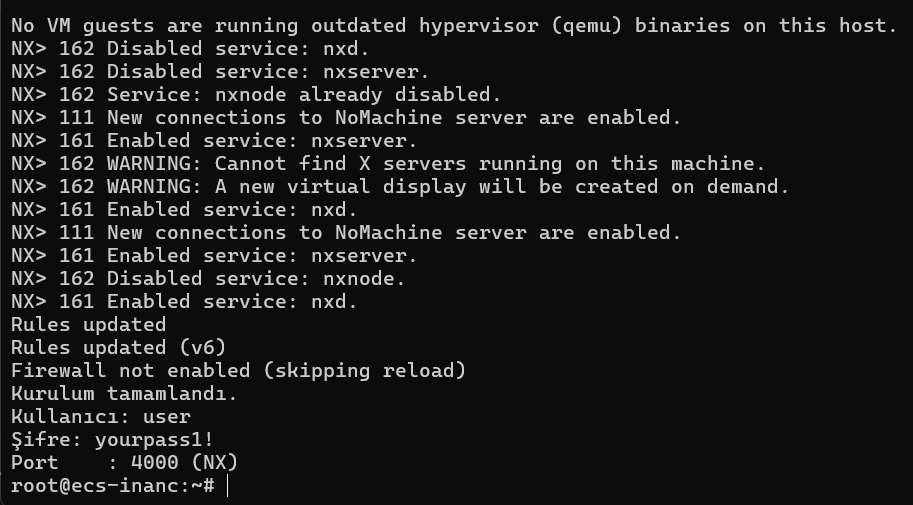
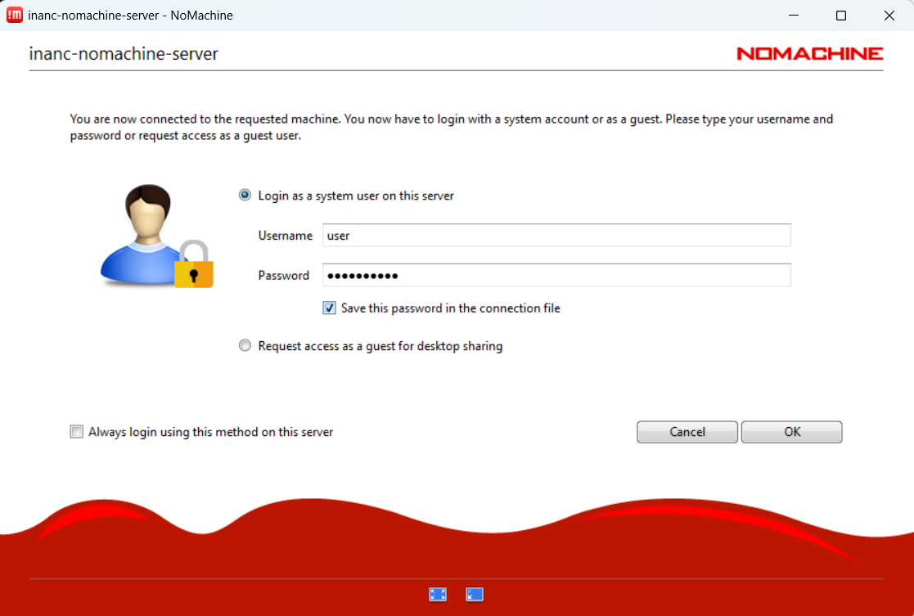
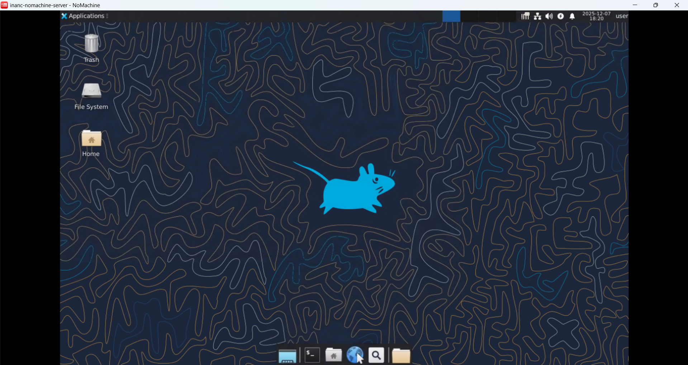

# NoMachine + XFCE4 Kurulumu
Kurulum Adımlarını [setup-steps.md](./setup-steps.md) dosyası üzerinden takip edebilirsiniz. 

## Hızlı Kurulum

Aşağıdaki komutu terminale yapıştırın ve çalıştırın. Kurulum 5-10 dakika sürecektir.

```bash
git clone https://github.com/colak-inanc/nomachine-xfce-setup.git && \
chmod +x nomachine-xfce-setup/setup.sh && \
sudo ./nomachine-xfce-setup/setup.sh
```

Kurulum tamamlandığında terminal aşağıdaki gibi görünecektir:



## NoMachine Bağlantısı

1. Bilgisayarınıza kurulu NoMachine'i açın
2. Yeni bir sunucu ekleyin (IP adresini terminal çıktısından alabilirsiniz)
3. Login ekranında terminal çıktısındaki kullanıcı adı ve şifre bilgilerini kullanın

Not: Bu adımla ilgili tüm detaylar medium yazısında verilmiştir. Hemem yandaki link üzerinden Medium yazısına erişim sağlayabilirsiniz. [NoMachine + XFCE ile En Stabil Remote Desktop Kurulumu](./setup-steps.md)



Artık sunucunuza GUI üzerinden erişebilirsiniz:


